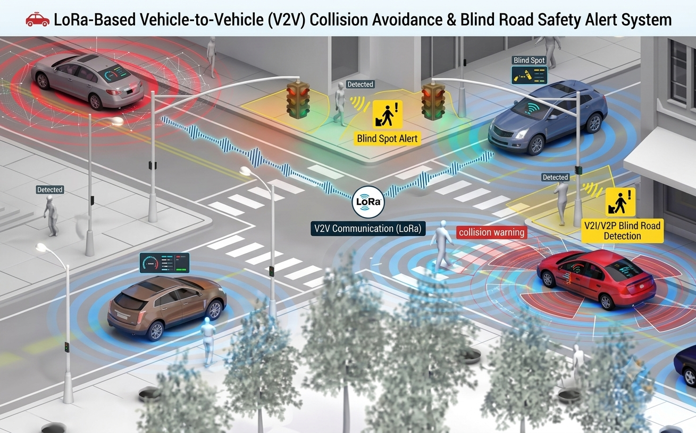

# 🚗 LoRa-Based Vehicle-to-Vehicle Collision Avoidance & Blind Road Safety Alert System

---

## 📌 Overview

The **LoRa-Based Vehicle-to-Vehicle Collision Avoidance & Blind Road Safety Alert System** is an intelligent transportation safety solution designed to reduce accidents occurring at blind intersections, narrow streets, hidden road exits, and low-visibility road junctions.

The project enables vehicles to exchange real-time safety information using long-range LoRa wireless communication and embedded sensing technologies.

# 📸 System Design & Implementation

<table>
<tr>
<td align="center">
<br>
<b>Hardware Prototype</b>
</td>

<td align="center">
<br>
<b>Circuit Diagram</b>
</td>
</tr>
</table>

---

The system integrates:

* Vehicle-to-Vehicle Communication (V2V)
* LoRa Wireless Networking
* Embedded Systems
* Proximity Detection
* Collision Warning Algorithms
* Smart Transportation Technologies

into a compact low-cost architecture capable of providing:

✅ Vehicle Presence Detection

✅ Blind Road Warning Alerts

✅ Real-Time Safety Notifications

✅ Collision Risk Awareness

in real time.

The system is specifically designed for urban environments where drivers have limited visibility due to buildings, walls, narrow roads, and hidden intersections.

---

# 🚀 Key Features

* 🚗 Real-Time Vehicle-to-Vehicle Communication
* 📡 Long-Range LoRa Wireless Connectivity
* ⚠️ Blind Intersection Collision Prevention
* 📶 RSSI-Based Vehicle Proximity Detection
* 📏 Ultrasonic Distance Measurement
* 🔔 Audible Warning Alert System
* 📺 OLED/TFT-Based Visual Notification System
* ⚡ Low-Power Embedded Architecture
* 🌐 Smart Transportation Ready
* 💰 Cost-Effective Road Safety Solution
* 🔋 Portable Vehicle Integration
* 🛣️ Hidden Road Exit Detection

---

# 🏗️ System Architecture

```text
Vehicle A
    │
ESP32 Controller
    │
LoRa SX1278 Module
    │
═══════════════════════
    LoRa Network
═══════════════════════
    │
LoRa SX1278 Module
    │
ESP32 Controller
    │
Vehicle B

Vehicle Detection
        ↓
RSSI Analysis
        ↓
Distance Verification
        ↓
Risk Evaluation
        ↓
Warning Generation
 ┌───────────────────┐
 │ TFT/OLED Display  │
 │ Buzzer Alert      │
 │ Driver Warning    │
 └───────────────────┘
```

---

# 🛠️ Hardware Components

| Component                 | Purpose                 |
| ------------------------- | ----------------------- |
| ESP32 Development Board   | Main Processing Unit    |
| LoRa SX1278 Module        | Vehicle Communication   |
| 17cm LoRa Antenna         | Long Range Transmission |
| HC-SR04 Ultrasonic Sensor | Distance Detection      |
| SH1106 OLED Display       | Status Display          |
| ST7735 TFT Display        | Visual Interface        |
| Active Buzzer             | Audio Alert             |
| Breadboard                | Prototyping             |
| Jumper Wires              | Connections             |
| USB Cable                 | Programming & Power     |

---

# 💻 Software & Technologies

## Programming Languages

* Embedded C++
* Arduino Framework

## Communication Technologies

* LoRa SX1278
* SPI Communication
* I2C Communication

## Embedded Systems

* ESP32
* Real-Time Processing
* Sensor Integration

## Transportation Technologies

* Vehicle-to-Vehicle Communication
* Intelligent Transportation Systems (ITS)
* Smart Mobility Systems

---

# 📡 Communication Logic

* Vehicle continuously broadcasts unique vehicle ID.
* Nearby vehicles receive transmitted packets.
* RSSI values estimate vehicle proximity.
* Ultrasonic sensor validates nearby obstacles.
* Collision risk is calculated.
* Driver receives warning alerts through display and buzzer.

---

# 🧠 Core System Modules

* LoRa Communication Engine
* Vehicle Identification Module
* RSSI Signal Processing
* Distance Measurement Module
* Collision Detection Logic
* Alert Generation System
* Display Management System
* Embedded Safety Controller

---

# 📂 Project Structure

```bash
├── hardware/
│   ├── circuit_diagrams/
│   ├── pcb_design/
│   └── wiring_schematics/
│
├── firmware/
│   ├── car01/
│   ├── car02/
│   └── integrated_system/
│
├── docs/
│   ├── reports/
│   ├── presentations/
│   └── testing_results/
│
├── images/
│
├── README.md
│
└── LICENSE
```

---

# ⚙️ Installation

## Clone Repository

```bash
git clone https://github.com/supriyasen2005-Hack/LoRa-V2V-Collision-Avoidance-System.git
```

## Enter Project Folder

```bash
cd LoRa-V2V-Collision-Avoidance-System
```

## Open Arduino IDE

Install Required Libraries:

```text
LoRa
Adafruit GFX
Adafruit ST7735
U8g2
SPI
Wire
```

Upload firmware to both ESP32 boards.

---

# ▶️ Usage

1. Power ON both vehicle units.
2. ESP32 initializes LoRa communication.
3. Vehicles continuously exchange IDs.
4. RSSI values determine proximity.
5. Ultrasonic sensor measures nearby distance.
6. System evaluates collision risk.
7. Driver receives:

   * Vehicle Detection Status
   * Signal Strength Information
   * Distance Information
   * Collision Alert Warning

---

# 🌍 Applications

* Smart Transportation Systems
* Vehicle Safety Solutions
* Blind Road Monitoring
* Smart City Infrastructure
* Intelligent Traffic Management
* Road Safety Research
* IoT-Based Transportation Systems
* Collision Avoidance Systems

---

# 🔮 Future Enhancements

* GPS Integration
* AI-Based Collision Prediction
* Vehicle Speed Estimation
* Cloud Connectivity
* Mobile Application Support
* Multi-Vehicle Networking
* Smart Traffic Infrastructure Integration
* Autonomous Vehicle Communication
* Emergency Vehicle Prioritization

---

# 📊 Research Domains

* Embedded Systems
* Wireless Communication
* Internet of Things (IoT)
* Vehicle-to-Vehicle Communication
* Intelligent Transportation Systems
* Smart Mobility
* Road Safety Engineering
* Cyber-Physical Systems

---

# 🤝 Contributing

Contributions are welcome.

## Steps

1. Fork the repository
2. Create a feature branch
3. Commit changes
4. Push updates
5. Open a Pull Request

---

# 📜 License

This project is licensed under the MIT License.

---

# 👨‍💻 Author

## Supriya Sen

Electronics Engineering Student

Focused on:

* Embedded Systems
* Wireless Communication
* Intelligent Transportation Systems
* Smart Mobility Solutions
* IoT Applications
* Vehicle Safety Technologies

---

# ⭐ Support

If you like this project:

⭐ Star the repository

🍴 Fork the project

📢 Share the project

🚗 Help build safer and smarter transportation systems

---
